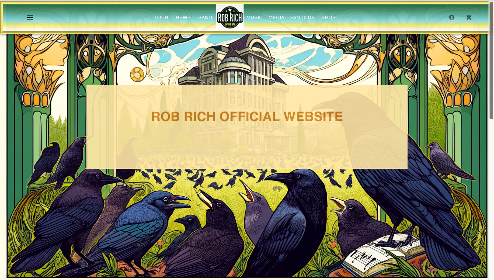

# Rob Rich Artist Website

Official digital space of the artist & musician Rob Rich.

## Description

Includes media player, performance dates, media gallery, artist biography, contact info, fan club, news and merchandise sales.

## Demo
Hero

Footer Top

Footer Bottom


## Getting Started

### Dependencies

* NodeJS
* Typescript
* MaterialUI

### Installing

* Fork and clone from Github

### Executing program

* Install the node modules, run the app.
* From the site folder, run the terminal commands:
```
npm install
npm start
```

## Help

Advise for common problems or issues:
```
Scream louder.
```

## Authors

Tyler Pritchard  
[@tyler-pritchard](https://github.com/tyler-pritchard)

## Version History

* 0.2
    * Various bug fixes and optimizations
    * See [commit change]() or See [release history]()
* 0.1.0
    * Initial Release

## License

This project is licensed under the MIT License - see the [LICENSE.md](LICENSE.md) file for details

## Acknowledgments

Inspiration, code snippets, etc.
* [Metallica](https://www.metallica.com)
